<!-- Hello There :D -->

# funnyboy_roks

Hello, I'm funnyboy_roks, or Funny! I have been programming for about
eight years, building various applications and tools.

I build a lot of random bits of software, including libraries, CLI
tools, web-sites, programming languages, Minecraft plugins, and so much
more.  The vast majority of software that I build is open-source and
placed in my
[repositories](https://github.com/funnyboy-roks?tab=repositories).

I primarily do low-level programming in languages like Rust, writing
software that interacts with the operating system or some embedded
applications.  I have also been known to write some Java and do the
occasional web-development.

I am also one of the core maintainers of [Basalt](https://basalt.rs), a
FOSS programming competition system.  We are always looking for new
contributors and if you're new to Open Source, I'd recommend looking
there!

> If you'd like to work with me, please [reach out](#contact)!

## Languages

I thoroughly enjoy programming languages and their design.  As such,
I've played around with so many different languages (and even built some
of my own!), though I use a handful for the majority of my projects.

Most-used languages: [Rust], [C], [JavaScript]/[TypeScript], [Java]

[Rust]:       https://github.com/funnyboy-roks?tab=repositories&language=rust
[C]:          https://github.com/funnyboy-roks?tab=repositories&language=c
[JavaScript]: https://github.com/funnyboy-roks?tab=repositories&language=javascript
[TypeScript]: https://github.com/funnyboy-roks?tab=repositories&language=typescript
[Java]:       https://github.com/funnyboy-roks?tab=repositories&language=java

## Links

- [Personal Website](https://funnyboyroks.com)
- [Modrinth](https://modrinth.com/user/funnyboy-roks)

## Contact

If you need assistance or have a suggestion for a Minecraft plugin or
any other application, please join my [Discord
server](https://funnyboyroks.com/discord) or make an issue on the
dedicated repository.

For all other senders, please email me at
[`fbr@funnyboyroks.com`](mailto:fbr@funnyboyroks.com).
